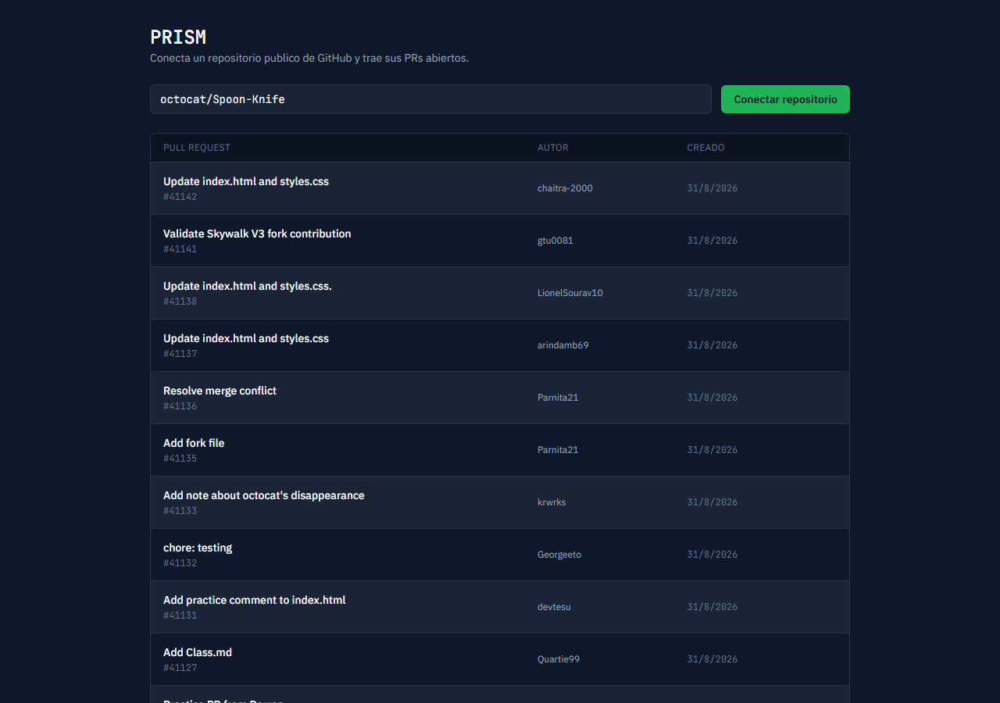
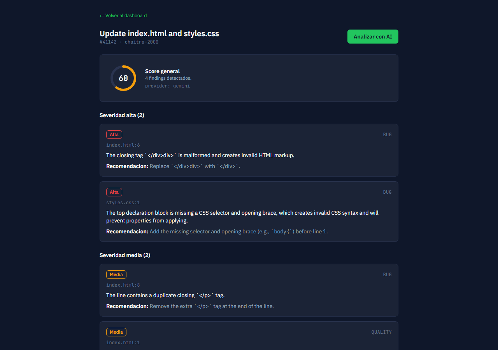

# PRISM

AI Code Reviewer — analiza Pull Requests de GitHub con AI y devuelve findings (bugs, seguridad, performance, calidad) agrupados por severidad, más un score explicable.

Este repo es el backend (FastAPI + PostgreSQL). El frontend (Next.js) vive en [prism-frontend](https://github.com/MathiasMartinez02/prism-frontend).

## Problema

Revisar un Pull Request a mano toma tiempo y depende de que el reviewer humano tenga el contexto fresco. Los checks automáticos tradicionales (linters, tipos) no razonan sobre la lógica del cambio — no detectan un N+1 query nuevo, un caso borde no cubierto, o una recomendación de mejor práctica sobre el diff puntual.

## Solución

PRISM trae el diff real de un PR, lo parte en hunks (con contexto alrededor de cada cambio) y le pide a un modelo de AI que lo analice hunk por hunk, devolviendo findings estructurados (categoría, severidad, archivo, línea, descripción, recomendación) y un score agregado con una fórmula simple y explicable — no un número "mágico" que nadie puede auditar.

## Arquitectura

```text
                    GitHub API
                        │
              ┌─────────┴──────────┐
              │                    │
        github_client.py     (diff_url del PR)
              │                    │
              ▼                    ▼
        repositories/PRs      diff_parser.py
        (sync, idempotente)   (unidiff → hunks,
                                filtra lockfiles/
                                binarios/generados)
                                    │
                                    ▼
                              analyzer.py
                        (concurrencia acotada,
                         Semaphore(3))
                                    │
                                    ▼
                             AIProvider (ABC)
                            ┌───────┴────────┐
                     GeminiProvider   OllamaProvider
                      (cloud, API)    (local, sin costo)
                                    │
                                    ▼
                              scorer.py
                       (formula documentada)
                                    │
                                    ▼
                          PostgreSQL (Alembic)
                   repositories · pull_requests
                      analyses · findings
                                    │
                                    ▼
                         Frontend (Next.js)
                    dashboard + detalle de PR
```

`AIProvider` es una interfaz abstracta (`app/ai/provider.py`) — cambiar de Gemini a Ollama (o sumar otro proveedor mañana) es una clase nueva, no un rediseño. Se elige con la env var `AI_PROVIDER`.

## Features

Solo lo que existe y funciona hoy:

- Conectar un repositorio público de GitHub y listar sus PRs abiertos (persistido en DB, idempotente — sincronizar dos veces no duplica filas).
- Disparar un análisis de AI sobre un PR puntual: trae el diff real, lo analiza hunk por hunk, calcula el score y guarda todo.
- Dos proveedores de AI intercambiables por env var: **Gemini** (cloud, capa gratuita) y **Ollama** (modelos locales, sin costo — ver nota más abajo).
- Findings categorizados (`bug` · `security` · `performance` · `quality` · `tests`) con severidad (`low` · `medium` · `high`), agrupados visualmente en el frontend.
- Score explicable: `100 - penalizaciones por finding`, nunca negativo (fórmula completa abajo).
- Historial de análisis por PR (`GET /pull-requests/{id}/analyses`) — un análisis fallido queda guardado con el error real, no se pierde.
- Manejo de errores real: repo inexistente, token inválido, rate limit de GitHub, timeout de red o cuota de AI agotada nunca tiran abajo el proceso — el hunk o el análisis que falla queda registrado, el resto sigue.
- Health check (`/health`) que valida conexión real a la base, no solo que el proceso esté vivo.

### Fórmula de score

```text
score = 100
  - (bugs_high * 15 + bugs_medium * 8 + bugs_low * 3)
  - (security_high * 20 + security_medium * 10 + security_low * 5)
  - (performance_issues * 5)
  - (quality_issues * 2)
  - (tests_issues * 2)
score = max(score, 0)
```

Implementada en `app/services/scorer.py`, con tests unitarios que cubren cada categoría.

## Tech Stack

```text
Python 3.12 · FastAPI · SQLAlchemy 2.0 · Alembic · PostgreSQL
httpx · unidiff · pydantic-settings
google-genai (Gemini) · ollama (SDK)
pytest · pytest-asyncio · respx · ruff
Docker · Docker Compose · GitHub Actions
```

## Getting Started

Requiere Docker y Docker Compose. El `docker-compose.yml` vive en la carpeta raíz del proyecto (un nivel arriba de este repo), junto al repo del frontend:

```text
prism/
├── prism-backend/   (este repo)
├── prism-frontend/
└── docker-compose.yml
```

```bash
cp prism-backend/.env.example prism-backend/.env
# completar GITHUB_TOKEN (opcional para repos publicos) y GEMINI_API_KEY
cp prism-frontend/.env.example prism-frontend/.env

docker compose up -d --build
```

Esto levanta PostgreSQL, aplica las migraciones automáticamente, y levanta el backend en `http://localhost:8000` y el frontend en `http://localhost:3000`.

### Desarrollo local sin Docker (backend)

```bash
pip install -e ".[dev]"
cp .env.example .env
uvicorn app.main:app --reload
```

### Elegir el proveedor de AI

```bash
# Gemini (capa gratuita, necesita API key de https://aistudio.google.com/apikey)
AI_PROVIDER=gemini
GEMINI_API_KEY=...

# Ollama (modelos locales, $0, requiere Ollama corriendo)
AI_PROVIDER=ollama
OLLAMA_HOST=http://localhost:11434   # o http://host.docker.internal:11434 si el backend corre en Docker
OLLAMA_MODEL=qwen2.5-coder:7b
```

> **Nota:** la capa gratuita de Gemini tiene un límite bajo de requests por día (no por minuto). Si lo alcanzás durante pruebas intensivas, el pipeline no se rompe — cada hunk que falla queda registrado en los logs del backend y el análisis simplemente no encuentra findings ahí. Cambiar a `AI_PROVIDER=ollama` evita el límite por completo.

## Docker

```bash
docker compose up -d --build   # levanta todo desde cero
docker compose logs -f backend # ver logs (incluye las migraciones al arrancar)
docker compose down            # bajar todo (agregar -v para borrar tambien los datos)
```

El `Dockerfile` del backend corre `alembic upgrade head` automáticamente antes de levantar el server — no hace falta ningún paso manual de setup de base de datos.

## Testing

```bash
pip install -e ".[dev]"
pytest        # suite completa
ruff check .  # lint
```

38 tests, sin mocks de más: `diff_parser` y `scorer` son unitarios puros (sin AI de por medio); `github_client`, `gemini_provider` y `ollama_provider` mockean la llamada de red con `respx`/`unittest.mock` para no gastar cuota ni depender de un servicio externo corriendo. CI (GitHub Actions) corre lint + tests en cada push/PR.

## Security

- `GITHUB_TOKEN` y `GEMINI_API_KEY` salen siempre de variables de entorno — nunca hardcodeados, `.env` está en `.gitignore`.
- CORS restringido a los orígenes configurados en `CORS_ORIGINS` (por default solo el frontend local).
- Sin autenticación de usuarios todavía (fuera de scope del MVP) — pensado para uso personal/demo, no multi-tenant.

## Observability

- Cada `Analysis` guarda `prompt_version` (para saber con qué versión de prompt se generó un finding) y `error_message` si falló, en vez de perder el intento.
- Los providers de AI loguean (`logging.warning`) cuando descartan un hunk por error de red/API o por respuesta inválida — sin esto, un rate limit agotado se vería idéntico a "no hay findings".
- El análisis corre de forma síncrona (el usuario espera unos segundos): en producción esto sería un background job con cola (ej. Celery/RQ + Redis) para no bloquear el request — se documenta el trade-off en vez de resolverlo antes de tiempo, ya que el MVP no lo necesita todavía.

## Deployment

No hay un demo público hosteado todavía — correrlo localmente con `docker compose up` (arriba) es la forma soportada hoy. La imagen de backend (`Dockerfile`) y de frontend son standalone y buildean sin depender de nada más que el propio repo, así que despliegan tal cual en cualquier PaaS con soporte Docker (Railway, Render, Fly.io) más una instancia de PostgreSQL gestionada.

## Demo

Dashboard: conectás un repo público de GitHub y ves sus PRs abiertos (datos reales, sin mockear):



Detalle de PR con un análisis real ya corrido (mismo PR, resultado real de Gemini — no un mock):



```text
Overall Score: 60/100

[high/bug] index.html:6
  El cierre de la etiqueta div esta malformado ("</div>div>"), genera HTML invalido.
  -> Reemplazar por "</div>".

[high/bug] styles.css:1
  Al bloque de declaracion le falta el selector y la llave de apertura,
  es CSS invalido y las propiedades no van a aplicar.
  -> Agregar el selector y la llave faltantes (ej. "body {") antes de la linea 1.

[medium/bug] index.html:8
  La linea tiene una etiqueta de cierre "</p>" duplicada.
  -> Remover el "</p>" redundante al final de la linea.

[medium/quality] index.html:1
  Se elimino la estructura estandar de HTML (DOCTYPE, html, head, body).
  -> Restaurar la estructura estandar de documento HTML.
```

## License

MIT — ver [LICENSE](LICENSE).
